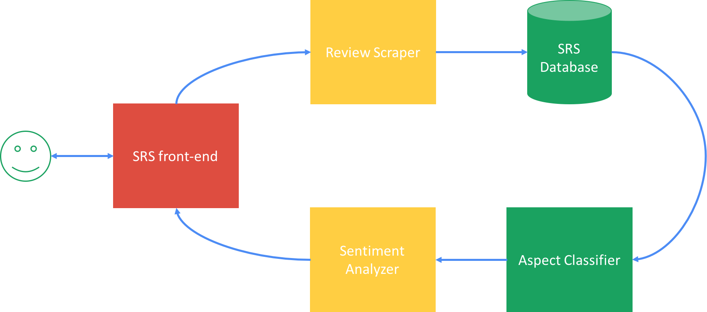

# Smart Review Summarization (SRS) Overview

## Motivation

Over the past decade, lots of human activities have been steadily switched to online versions: Amazon for shopping, Yelp for dining, Netflix for entertaining, etc. To help customers make informed decisions, almost all of them provide customer review systems. However, lots of popular products have hundreds to even thousands of reviews, which makes it almost impossible to read through, summarize and compare against other products. 

Here we present our application **SRS**, which is designed to tackle the above issue. By using Natural Language Processing and Machine Learning techniques, **SRS** is able to instantly help summarize customers' opinions on various aspects of a particular product. On top of that, it also enables users to compare sentiment scores for two similar products.

## Workflow

An **SRS** user is only required to type in a product ID or product URL from Amazon, the rest of work will be taken care of by **SRS internal workflow**. 

Once *SRS front-end* gets user query, it invokes *Review Scraper* to work, which collects reviews and stores into *SRS Database*. Then *Aspect Classifier* starts to analyze each sentence in the reviews, classifying which aspects the review is discussing (e.g., `I like this camera, it can last whole day without re-charging` will be classified as `battery`). Later *sentiment analyzer* aggregates review positivity for each aspect and send the summary to *SRS front-end* to present. A typical summary box plot is shown below.

## Review Scraper

Once user requests for a product, **Review Scraper** will first be triggered if the product is not recorded before in database. By using `python-amazon-simple-product-api`, **Review Scraper** is able to scrape reviews page by page. 

This process can be fairly long especially for products with thousands of reviews. A time limit of 30 seconds is set and top *helpful* reviews are first scraped so that users can get most relevant information within reasonable time. In order to make reviews gradually complete, **Review Scraper** is able to continue scraping from where previous scraping stops. Once a product's reviews are considered complete (a certain ratio between number of reviews in database and total number of reviews online), future requests for that product don't trigger **Review Scraper** any more.

## Aspect Classifiers

One review usually contains many points, covering more than one aspects of a product. One of the biggest values this project creates is provide sentiment scores for each aspect of the product so that users are informed in a much deeper level compared with given an overall score. So the most crucial part of **SRS** is to classify each sentence into several aspects.

Currently, we've designed an extensible classification framework with three interchangeable classifiers: **maxEntropy**, **word2vec**, **word2vec_svm**.

### maxEntropy

### word2vec

### word2vec_svm

## Sentiment Analyzer

After classification, all the review sentences are grouped by aspects.  **Sentiment Analyzer** is designed to go through sentences aspect by aspect and assigns sentiment scores for each single sentence. Eventually each aspect has a distribution of sentiment, which makes it ready for final rendering in **SRS front-end** as well as comparison with another product if necessary.

