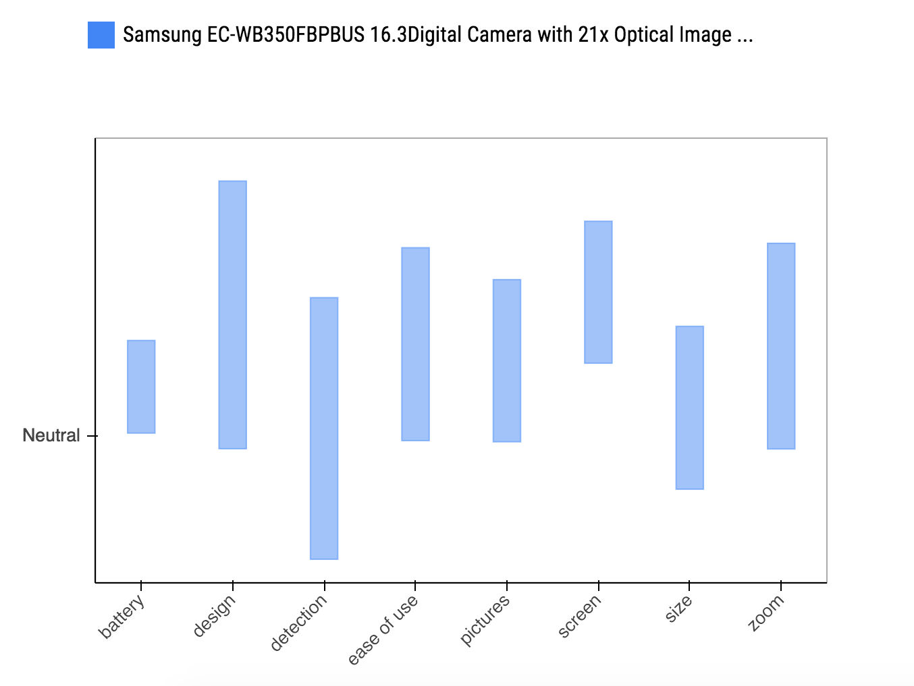

# Smart Review Summarization (SRS) Overview

## Motivation

Over the past decade, lots of human activities have beed steadily switched to online versions: Amazon for shopping, Yelp for dining, Netflix for entertaining, etc. To help customers make informed decisions, almost all of them provide customer review systems. However, lots of popular products have hundreds to even thousands of reviews, which makes it almost impossible for human to read through, summarize and compare. 

Here we present our application **SRS**, which is designed to tackle the above issue. By using Natural Language Processing and Machine Learning techniques, **SRS** is able to instantly help summarize customers' opinions on various aspects of a particular product. On top of that, it also enables users to compare sentiment scores for two similar products.

## Workflow

An **SRS** user is only required to type in a product ID or product URL from Amazon, the rest of work will be taken care of by **SRS internal workflow**. 

Once *SRS front-end* gets user query, it invokes *Review Scraper* to work, which collects reviews and stores into *SRS Database*. Then *Aspect Classifier* starts to analyze each sentence in the reviews, classifying which aspects the review is discussing (e.g., `I like this camera, it can last whole day without re-charging` will be classified as `battery`). Later *sentiment analyzer* aggregates review positivity for each aspect and send the summary to *SRS front-end* to present. A typical summary box plot is shown below.

## Review Scraper

## Aspect Classifiers

## Sentiment Analyzer

